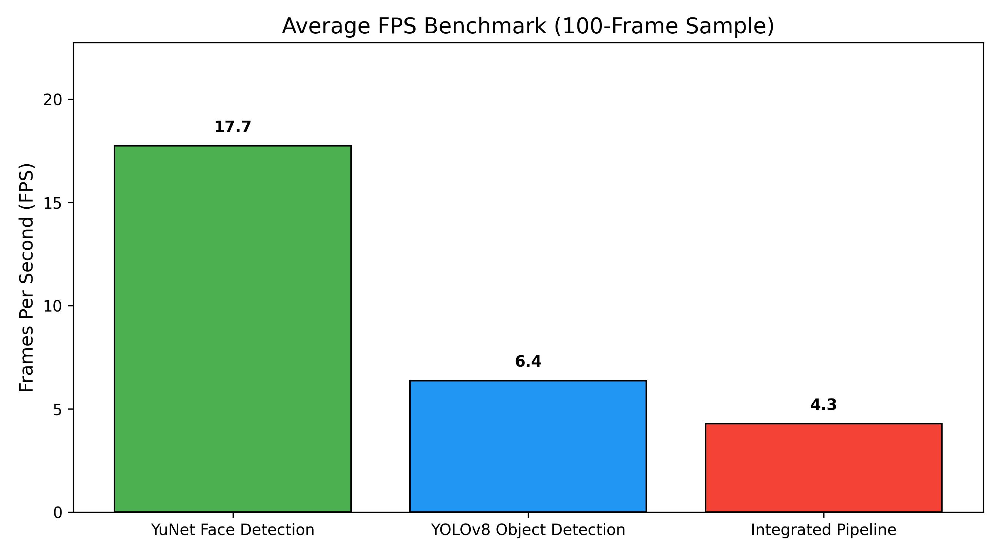

# 🧠 Computer Vision PR3 — Deep Learning

A complete **Computer Vision pipeline** developed as part of the Deep Learning PR3 project at **Red & White Skill Education**.

This project progresses from classical image-processing techniques to modern deep-learning-based detection, combining **OpenCV**, **YuNet**, and **YOLOv8** in an integrated real-time computer vision pipeline.

## 📌 Project Walkthrough

[View Project Walkthrough](https://drive.google.com/drive/folders/1Z16hYBCSq4AtFRl37Ouryc4u1rkhTnIu?usp=drive_link)


---

## 📌 Project Overview

The project demonstrates how different computer vision techniques can work together in a practical image-analysis and detection workflow.

### Main Topics

* 🔹 Morphological Operations
* 🔹 Bitwise Image Operations
* 🔹 Image Histograms
* 🔹 Brightness & Contrast Adjustment
* 🔹 Face Detection using YuNet
* 🔹 Object Detection using YOLOv8
* 🔹 Real-time Webcam Detection
* 🔹 Confidence & IoU Threshold Tuning
* 🔹 Morphological Pre-processing
* 🔹 FPS Benchmarking
* 🔹 Integrated Face + Object Detection Pipeline

The project moves from **classical, hand-engineered image processing** toward **deep-learning-based computer vision**, following a workflow similar to practical real-time CV systems.

---

## 🚀 Project Pipeline

```text
Input Image / Webcam
        │
        ▼
┌─────────────────────────┐
│ Image Pre-processing    │
│ • Grayscale             │
│ • Thresholding          │
│ • Morphology            │
│ • Bitwise Operations    │
└────────────┬────────────┘
             │
             ▼
┌─────────────────────────┐
│ Image Analysis          │
│ • Histograms            │
│ • Brightness            │
│ • Contrast              │
└────────────┬────────────┘
             │
             ▼
      ┌──────────────┐
      │ Detection    │
      └──────┬───────┘
             │
       ┌─────┴─────┐
       ▼           ▼
    YuNet         YOLOv8
 Face Detection  Object Detection
       │           │
       └─────┬─────┘
             ▼
┌─────────────────────────┐
│ Integrated CV Pipeline  │
│ Face + Object Detection │
│ + FPS Benchmarking      │
└─────────────────────────┘
```

---

# 🔬 Tasks Implemented

## 1. Morphological Operations

Classical morphological image-processing techniques are applied to binary images using OpenCV.

Implemented:

* **Erosion**
* **Dilation**
* **Opening**
* **Closing**

A `5×5` kernel is used initially, followed by comparisons of different kernel shapes and sizes.

### Kernel Comparison

The project compares:

* Rectangular kernel
* Elliptical kernel
* Cross-shaped kernel

with:

* `3×3`
* `5×5`
* `9×9`

kernels.

Morphological operations are useful for removing noise, filling small gaps, and improving image masks before downstream detection.

---

## 2. Bitwise Operations & Image Histograms

The project demonstrates fundamental pixel-level logical operations:

* `AND`
* `OR`
* `XOR`
* `NOT`

Binary masks are created using geometric shapes and then combined using OpenCV bitwise operations.

### Applied Use Case

Bitwise operations are also used for:

* Region-of-interest masking
* Extracting specific image regions
* Image compositing

### Histograms

Both grayscale and color histograms are analyzed.

For color images, separate:

* Blue
* Green
* Red

channel histograms are calculated.

---

## 3. Brightness & Contrast Analysis

Image brightness and contrast are adjusted using:

```python
new_pixel = alpha * pixel + beta
```

Where:

* `alpha` controls **contrast**
* `beta` controls **brightness**

The project compares different parameter settings and observes their effect on image histograms.

This provides a useful diagnostic for understanding whether an image requires pre-processing before being passed to a detection model.

---

# 👤 3. Face Detection with YuNet

The project uses **YuNet**, OpenCV's compact CNN-based face detector.

### Model

```text
face_detection_yunet_2023mar.onnx
```

The detector is loaded using:

```python
cv2.FaceDetectorYN_create()
```

### Features

YuNet provides:

* Face bounding boxes
* Confidence scores
* Five facial landmark points
* Static image detection
* Real-time webcam detection

The project also evaluates different confidence thresholds:

```text
0.5
0.7
0.9
```

This demonstrates the trade-off between detecting difficult faces and reducing false positives.

### Privacy Application

Detected face regions are selectively blurred using Gaussian Blur to demonstrate a simple **face anonymisation/privacy filter**.

---

# 🎯 4. Object Detection with YOLOv8

The project uses **YOLOv8-Nano (`yolov8n.pt`)**, a pretrained object-detection model trained on the COCO dataset.

```python
from ultralytics import YOLO

model = YOLO("yolov8n.pt")
```

### Capabilities

YOLO is used for:

* Static image object detection
* Real-time webcam detection
* Bounding boxes
* Class labels
* Confidence scores

The model can detect multiple object categories in a single image.

---

## ⚙️ Confidence & IoU Experiments

YOLO detection performance is evaluated using different:

### Confidence thresholds

```text
0.25
0.50
0.75
```

### IoU thresholds

```text
0.30
0.50
0.70
```

The experiment demonstrates how threshold selection affects the number of retained detections and overlapping bounding boxes.

Non-Maximum Suppression (**NMS**) is used to remove duplicate detections.

---

# 📊 5. Integrated Real-Time Pipeline

The final stage combines both deep-learning detectors into a single webcam pipeline.

### Detection Layers

🟢 **YuNet**

* Face detection
* Facial landmarks
* Confidence score

🔴 **YOLOv8**

* General object detection
* Class labels
* Confidence scores

Both annotation layers are displayed simultaneously on the same video stream.

---

## 🧹 Morphological Pre-cleaning

A light morphological opening operation can be applied before detection to reduce noise in camera frames.

The project compares detection results with and without this pre-processing step to investigate its effect on detection quality.

---

# ⚡ FPS Benchmarking

The project benchmarks three configurations:

| Configuration     | Description    |
| ----------------- | -------------- |
| Face Detection    | YuNet only     |
| Object Detection  | YOLOv8 only    |
| Combined Pipeline | YuNet + YOLOv8 |

The average FPS is measured over the same sample of frames and visualized using a bar chart.

### FPS Benchmark



---

# 📋 Final Comparison

| Technique           | Type          | Purpose                     | Main Advantage                    |
| ------------------- | ------------- | --------------------------- | --------------------------------- |
| Erosion             | Classical CV  | Remove small bright regions | Simple & fast                     |
| Dilation            | Classical CV  | Expand foreground regions   | Fills small gaps                  |
| Opening             | Classical CV  | Noise removal               | Useful for pre-processing         |
| Closing             | Classical CV  | Fill small holes            | Preserves object regions          |
| Bitwise Operations  | Classical CV  | Masking & compositing       | Precise pixel-level control       |
| Histograms          | Classical CV  | Intensity analysis          | Useful for image diagnostics      |
| YuNet               | Deep Learning | Face detection              | Lightweight face detector         |
| YOLOv8n             | Deep Learning | Object detection            | Multi-class real-time detection   |
| Integrated Pipeline | Hybrid        | Face + object detection     | Combines multiple CV capabilities |

---

# 🛠️ Technologies Used

* **Python 3.x**
* **OpenCV**
* **OpenCV YuNet**
* **Ultralytics YOLOv8**
* **NumPy**
* **Matplotlib**
* **Jupyter Notebook**

The project specification uses OpenCV, Ultralytics YOLOv8, NumPy and Matplotlib as the main framework stack.

---

# 📂 Repository Structure

```text
CV_PR3_Deep_Learning/
│
├── CV_PR3.ipynb
│
├── Images/
│   └── Input images used for experiments
│
├── figures/
│   └── FPS_BenchMarks.jpg
│
├── models/
│   └── YuNet / detection model files
│
└── README.md
```

The repository currently contains the notebook along with dedicated `Images`, `figures`, and `models` directories.

---

# ▶️ How to Run

## 1. Clone the repository

```bash
git clone https://github.com/Deepvejpara/CV_PR3_Deep_Learning.git
cd CV_PR3_Deep_Learning
```

## 2. Install dependencies

```bash
pip install opencv-python opencv-contrib-python ultralytics numpy matplotlib
```

## 3. Open the notebook

```bash
jupyter notebook CV_PR3.ipynb
```

or open it using **Google Colab / JupyterLab**.

## 4. Run the notebook

Run the tasks in order:

```text
Task 1 → Morphology
Task 2 → Bitwise + Histograms
Task 3 → YuNet
Task 4 → YOLOv8
Task 5 → Integrated Pipeline
```

> **Note:** Webcam-based sections require access to a webcam. The project specification uses `cv2.VideoCapture(0)` for real-time detection.

---

# 📦 Models

### YuNet

```text
face_detection_yunet_2023mar.onnx
```

A pretrained OpenCV YuNet face detector.

### YOLOv8

```text
yolov8n.pt
```

A pretrained YOLOv8-Nano model trained on the COCO dataset.

---

# 🎓 Learning Outcomes

Through this project, I explored the progression from classical computer vision to deep-learning-based detection.

### Classical Computer Vision

* Image thresholding
* Morphological transformations
* Kernel design
* Bitwise masking
* Image histograms
* Brightness and contrast manipulation

### Deep Learning Computer Vision

* CNN-based face detection
* YuNet
* YOLOv8
* Confidence thresholds
* IoU
* Non-Maximum Suppression
* Real-time inference
* FPS benchmarking

### Practical Computer Vision

The project demonstrates how classical pre-processing and deep-learning models can be combined into a practical real-time monitoring pipeline.

---

# 💡 Key Takeaways

* Morphological operations can clean noisy binary images before further processing.
* Bitwise operations provide useful pixel-level masking and compositing capabilities.
* Histograms help analyze image brightness, contrast, and exposure.
* YuNet provides lightweight face detection with facial landmarks.
* YOLOv8 can perform multi-class object detection using a pretrained model.
* Confidence and IoU thresholds have a direct effect on detection results.
* Combining face and object detectors creates a more capable real-time CV pipeline.
* FPS benchmarking helps evaluate the computational cost of different configurations.

---

# 🎥 Project Video

**Video Demonstration:**
[Add your Google Drive / YouTube Unlisted video link here]

The video demonstrates the notebook, concepts, live webcam detection, YOLO detection, and final benchmarking results.

---

# 📓 Notebook

**Jupyter Notebook:**
[CV_PR3.ipynb](CV_PR3.ipynb)

---

# 👨‍💻 Author

**Deep Vejpara**

BSc IT / Data Science & Machine Learning Enthusiast

GitHub: [@Deepvejpara](https://github.com/Deepvejpara)

---

# 📜 Project Information

**Institute:** Red & White Skill Education
**Subject:** Deep Learning
**Project:** PR 3 — Computer Vision
**Project Duration:** 3 Days
**Total Marks:** 10

This project was developed as an educational implementation covering classical image processing and deep-learning-based computer vision techniques.
